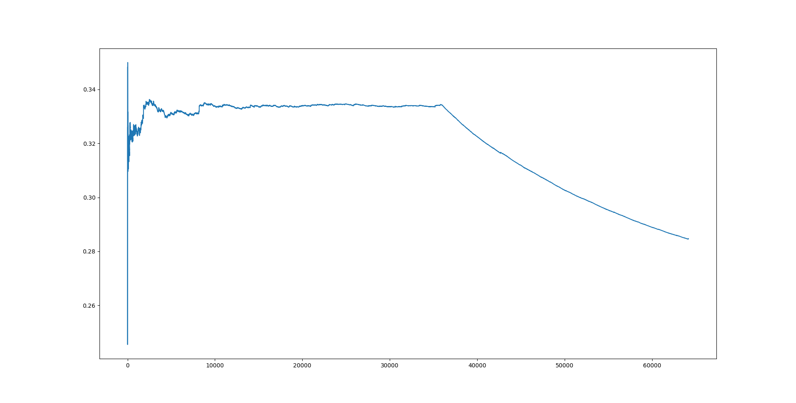
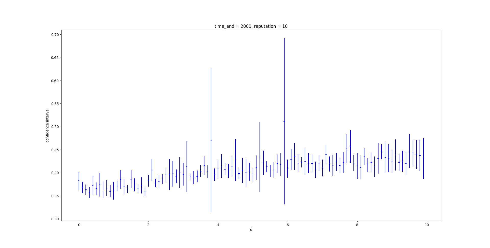
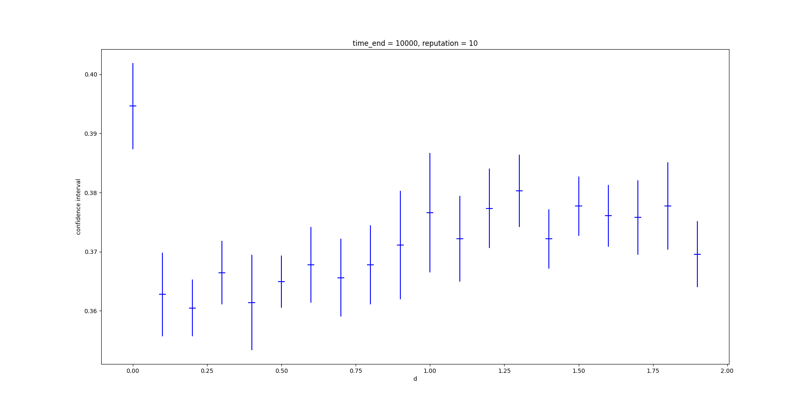
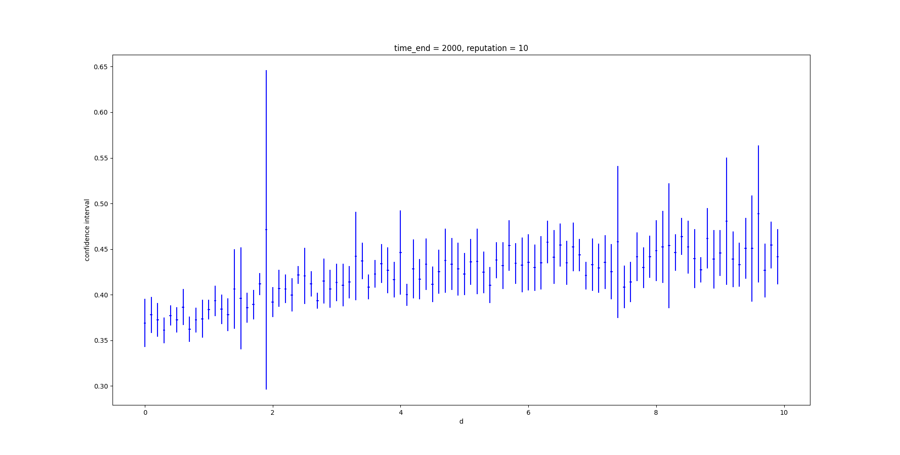
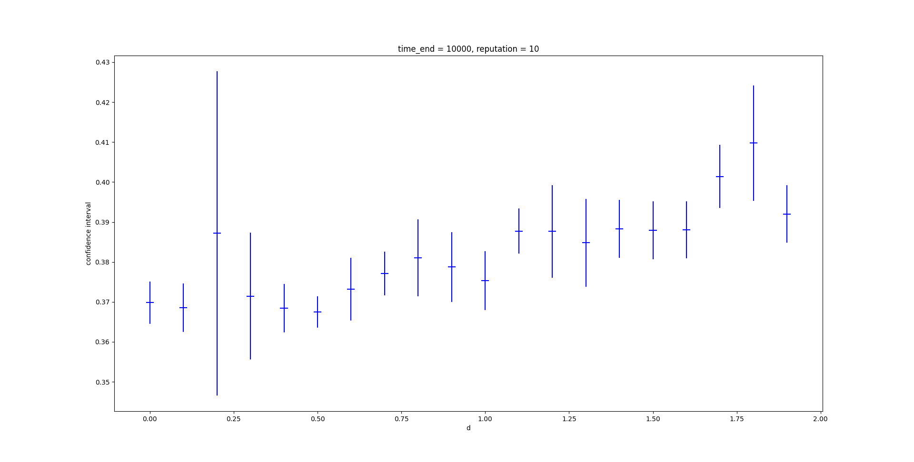

# Introduction

This report consists of two parts. The first part give details about my code. Like how each components works, what function are used, and how do I derive them.

The second part is the answer to the question given in the specification.

**Please use python3 if you want to run the code**

# Details of Code

There are many classes defined in my code. All the classes and functions used in this project are stored in `utils.py`. And the `main.py` uses the classes and function defined in `utils.py`. In this section, I would like to give a simple introduction to these classes.

## `job`

Job is a simple wrapper of a 2-tuple. It makes code easier to read when debugging.

## `server`

Class `server` is a simulated server. It contains a queue inside, storing jobs inside. The first item in the queue is the job currently processing and the rest of them are jobs queueing.

This class have two public member functions:

+ `update(time_point)`: updates the queue with provided time point
+ `num_of_jobs()`: returns the jobs remain in the server
+ `next_depature()`: returns the departure time of the processing job. If there is no job, the departure time is infinity
+ `assign_job(job)`: function for `dispatcher` to invoke, assigning a new job to a server

## `dispatcher`

A dispatcher receives jobs and assign jobs to servers with given load balancing algorithm. 

There are several options for a dispatcher when constructing object:

+ `slow_svr_rate`: processing rate of slow server
+ `fast_svr_rate`: processing rate of fast server
+ `d`: the parameter for priority
+ `algo_ver`: choose version 1 or version 2 are used for load balancing

When a job arrives, the `on_dispatch(arrival, workload)` function will be invoked and a job will be dispatched. In addition, a function called `next_depature()` was implemented for random data simulation to set the `master_clock`.

## `job_simulator`

The job simulator creates jobs for dispatcher to dispatch. It is an abstract base class and it have a function called `start` which generates jobs.

## `file_job_simulator`

This class reads jobs from files and passes jobs read from file to the dispatcher.

## `random_job_simulator`

This class creates jobs described in the project spec and passes the jobs to the dispatcher.
The random job simulator generates random interarrival time and service time with given distribution specified in the spec.

For this project, I used `np.random.exponential()` and `np.random.uniform()` to generate `ak`. In addition, there is a member function `service_time()` to generate random data with distribution specified. To derive function, I calculated the `CDF` of this function with integral, and then use the inverse transform method ([[Inverse transform sampling - Wikipedia](https://en.wikipedia.org/wiki/Inverse_transform_sampling)]) to get the function which can generate data meets the distribution.

## `steady_mean_response_time` and `mean_response_time`

The `steady_mean_response_time(job_assignment, steady=(0.0, 1.0))` returns the mean response time in provided interval. The parameter `steady` means which part of the response are calculate. This function was designed for finding out `d` for load balancing.

## `server_depart`

This function computes the departure time of job in a server and returns a string for writing into file.

## Other files

The `find_d.py` was a simple script to figure out proper d for different algorithms. Also, a folder called "special" was created to do this work.

The `image` folder keeps images generated for analyzing.

# Determining suitable values of d for load balancing

> *After writing your simulation program, your next step is to use your simulation program to investigate the following questions:*

Before I give the values of d, I would like to firstly shows how I get this value. First of all, the the data and graph generated in the answer are from **`find_d.py`**. So the whole process is reproducible. You can check the **`find_d.py` **to reproduce these images and data.

At the beginning I tried to find `d` because steps behind all need me to find the steady state. 

So I wrote a function called **`plot_mrt_steady(job_assignment)`**. This function will finally shows  how mean response time changed along with time.

It can be easily seen that from `10000` to `33000`, the response time got really steady. So, I decide to select the jobs processed in this interval to compute the steady mean response time.

## Question 1

> For load balancing algorithm (Version 1), what is the value of d that gives the best mean response time

For question 1 and 2, I wrote a function **`test_with_args(algo_ver, reputation, alpha, start, end, interval, time_end)`** to try to find proper value d. This function tries to find the confidence interval of different configuration. It prints confidence interval in the terminal, and also shows a graph. Since I don't know where to start, I tries to find all the confidence interval of different `d`s from 0 to 10. This is the image:

There are some observation. As `d` grows, the confidence interval trends to "expand", and seems like the mean response time also increases. So I decide to focus on 0-2 on the x axis. I run the program again, and I generate this graph:

  

So in this image, seems most configuration got similar mean response time. In my opinion, a smaller confidence interval should be a better choice given the fact that the server farm have a higher chance to stay stable. 

So I think the value of d for question 1 should be 0.2.

## Question 2

> For load balancing algorithm (Version 2), what is the value of d that gives the best mean response time ? You may determine d to up to an accuracy of 1 decimal place.

For question 2, I did the same procedure, here are the images:

Similar trend can be found in algorithm version 2. So I keep discovering range 0 to 2:

In version 2, I think d = 0.5 is appropriate.

## Question 3

> Statistically speaking, can load balancing algorithm (Version 2) achieve a lower mean response time compared to Version 1

Since d are found, in question 3, I will use paired-t confidence interval to find which system is better. Like what I did before, there is also a function called **`compare_server(rep, time_end)`** to solve this problem. Luckily I don't need to use common random numbers to solve this problem. 

I set `reputation` to be 30, and `time_end` to be 10000, and I got an interval `[-0.01330606 -0.00382564]`. Since I minus the steady mean response time of algorithm 1 with the steady mean response time of algorithm 2, this means that algorithm 2 is a better load balancing algorithm.

